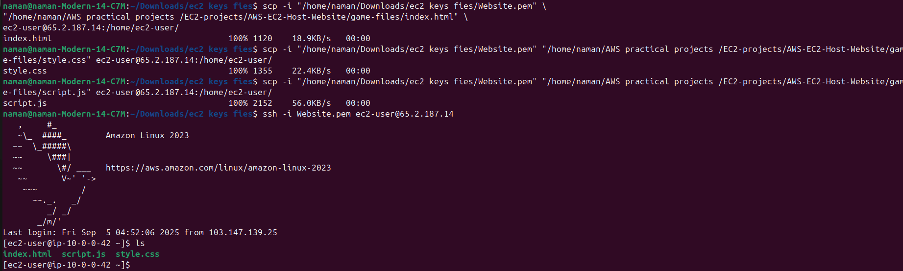
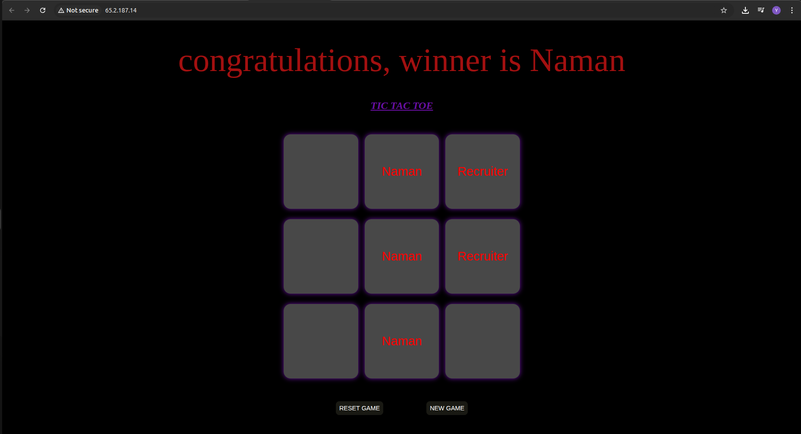

# Project 2: Host Static Website/Game on AWS EC2

## Objective
Host a static website/game on an **EC2 instance** using Apache web server.

---

## Steps
1. Launch an EC2 instance (Amazon Linux / Ubuntu).
2. Install Apache web server:
   ```bash
   sudo yum update -y
   sudo yum install httpd -y
   sudo systemctl start httpd
   sudo systemctl enable httpd
3. Upload website/game files to /var/www/html/
   ```bash
   sudo cp index.html /var/www/html/
4. Access the website using the Public IP of EC2.

---

## Screenshots

1. Apache installation success.


2. Game files uploaded.




3. Website running in browser.




---

## Key Learnings

1. Hosting static content on EC2.
2. Using Apache web server.
3. Understanding public access via Security Groups.

---

## Live Demo

1. Access at http://65.2.187.14


